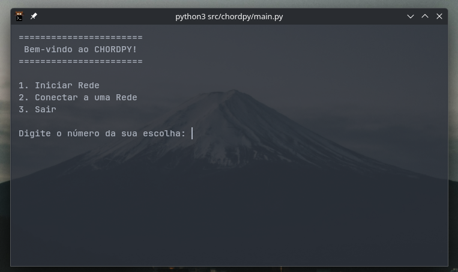

# ChordPy

> Um sistema de armazenamento chave-valor distribuído baseado no protocolo Chord e implementado em Python.


---

## Sobre o Projeto

**ChordPy** é uma implementação simplificada de uma Tabela de Hash Distribuída (DHT) baseada no protocolo Chord. Este projeto foi desenvolvido como parte da disciplina de **Estruturas de Dados e Algoritmos**, com o principal objetivo de explorar e entender na prática estruturas de dados mais _exóticas_.

O sistema cria um nó local que armazena _referências_ para seus pares, criando uma rede descentralizada e eficiente graças ao sistema de _finger tables_, onde cada nó possui referências para $log(n)$ pares, separados por distâncias exponencias. Utilizando desse artifício, o protocolo Chord consegue realizar buscas em tempo $O(log\ n)$, pois, no pior caso, corta a distância até o nó procurado pela metade.

## Funcionalidades Implementadas

- **Join:** Permite que um novo nó se junte ao anel Chord, recebendo as informações necessárias de um nó já existente.
- **Leave:** Permite que um nó saia do anel de forma planejada, transferindo suas chaves e responsabilidades.
- **Find Successor:** Algoritmo principal para encontrar o nó sucessor responsável por uma determinada chave no anel.
- **Estabilização:** Processo periódico executado pelos nós para garantir que os ponteiros de sucessor e predecessor estejam corretos, mantendo a consistência do anel mesmo com a entrada e saída de nós.

## Detalhes Técnicos

- **Comunicação em Rede:** A comunicação entre os nós da rede foi implementada utilizando a biblioteca nativa **socket**.
- **Algoritmo de Hash:** O algoritmo utilizado para gerar os identificadores dos nós e das chaves foi o **SHA-1**.
- **Espaço de Identificadores:** O anel Chord opera com um espaço de chaves de $16$ bits, o que significa que os identificadores variam de $0$ a $2^{16}-1$ (ou seja, de 0 a 65535).

## Como Usar


### Pré-requisitos

- Python 3.x

### Instalação e Execução

1. **Clone o repositório:**

    ```bash
    git clone <https://github.com/msadley/ChordPy.git>
    ```

2. **Navegue até o diretório do projeto:**

    ```bash
    cd ChordPy
    ```

3. **Inicie o programa:**

    ```bash
    python3 ./src/chordpy/main.py
    ```

Agora você pode executar os comandos a partir da interface de comando que aparece no terminal:

<p align="center">
  
</p>

## Autores

Este projeto foi desenvolvido pela seguinte equipe:

- Adley Silva Mendes
- Iury Ruan do Nascimento Santos
- João Pedro Araújo de Medeiros
- José Paulo Freitas da Silva Farias

## Contexto Acadêmico

Este projeto foi desenvolvido durante o estudo da disciplina de Estruturas de Dados e Algoritmos, ministrada pelo professor **João Arthur Brunet Monteiro**.
